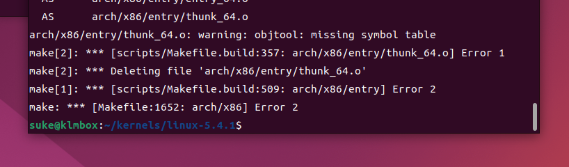
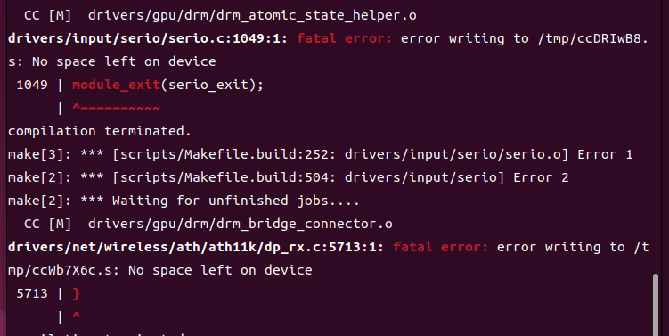
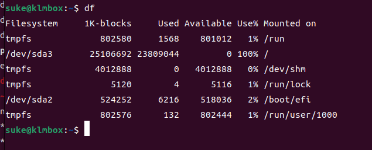
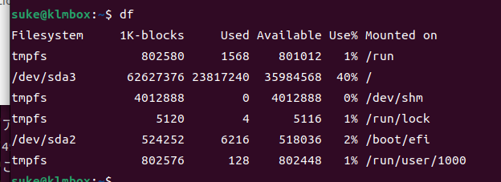
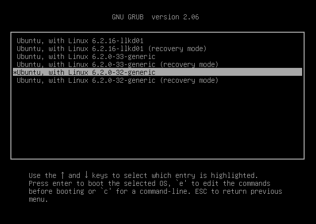
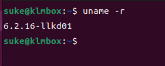
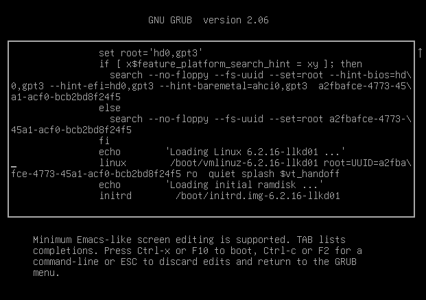

# Kernel Build
ch2までを終わらせていないと進められないので注意．
- [ ] kernelのソースを落としている
- [ ] 設定を終わらせている
- [ ] `.config`はすでに用意できている

## 確認・実行
1. `make all`(こっちは使わない)
   `make help`したときにでてくる項目の内、先頭に`*`がついているものがターゲットになってビルドされる．
   `*`がついている項目としては、
   * `vmlinux`
     * カーネルイメージとかシンボル情報とかデバッグ情報とか．配布されるとPwnerがニッコリするやつ
   * modules
     * menuconfigでmにした項目がこれに該当する．`.ko`みたいなファイルとしてビルドされる．
   * `bzImage`
     * `vmlinux`より圧縮されて小さくなったカーネルイメージ．ブートローダーによって起動時にRAMに展開されるやつがこれ．

   がある．
2. `time make -j4`
   `time`はコマンドの実行時間を測ってるだけ．
   Kernelのビルドは負荷のかかる作業なので、並列処理をするためにタスクをspawnするが、vmでやっているので好き放題やられると色々こまる．そこで`-jn`(nには任意の数字)を入れて増やせるタスクに上限を設ける．
   `nproc`でコアの数を確認して2倍すると並列処理できるタスクの目安の値になるらしい．vmの設定でcpuのコアは2にしているので`-j4`を与える．

### うまくいかない1
**ビルドが通らない！！**



#### 原因
VirtualBoxのGuestOSであるUbuntuと手元でビルドするために用意しているKernelのソースのバージョンが違うから．
`make menuconfig`する前に
```
lsmod > /tmp/lsmod.now
make LSMOD=/tmp/lsmod.now localmodconfig
```
を走らせているが、`make localmodconfig`はそのコマンドを走らせているローカルの環境を見て`.config`に反映していく．正確に説明するとローカルマシンでロードされているモジュールはビルドされるカーネルにもロードされるべき(使い勝手的な観点で)なので設定を揃えてくれる．

#### 解決策
簡単にいえばKernelのバージョンをVMのOSと手元のソースコードとで揃えられれば良い
* Ubuntuの18.04を使用する(本で使用しているバージョンにちゃんと揃える)
* Linux Kernel v6.2.16を使用する

後者を選んだ．なんでこのバージョンが出てくるのかについても軽く説明する．
```
suke@klmbox:~$ uname -r
6.2.0-32-generic
```
なので、6.2.0かなーと思うとこれは間違い．Ubuntuは独自で改造されたKernelなので本流でそれにあたるバージョンを得るためには以下を見る．
```
suke@klmbox:~$ cat /proc/version_signature
Ubuntu 6.2.0-32.32~22.04.1-generic 6.2.16
```
ここから上のバージョンを得る．
ch1-2でやったこととほぼ同様にしてソースコードを取得する．
`.config`の構成についてはローカルのマシンと同様の設定をベースにするので
```
cp /boot/config-$(uname -r) .config
```
で手元にコピーする．その上で`make menuconfig`して本の通りの設定を加えてビルドする．
```
make clean
make -j4
```

### うまくいかない2
**vmの容量がパンクした**





流石に終わったと思った．でもまだ入れる保険がある．vmのディスク拡張はVirtualBoxとGuestOS(Ubuntu)両方で作業が必要．

#### 解決策
##### VirtualBox側での操作
使用しているマシンのストレージ名を把握しておく．共通のツールからメディアを選択．ハードディスクからさっきの名前と同じものを選択．下のバーを動かして適当なストレージサイズに拡張．

##### GuestOS側での操作
`sudo apt install gparted`をすることが紹介されている記事もあるが、今さっきパンクしたばかりなのでインストールなんかできない!(この世の終わり)

* パーティションの拡張
`sudo cfdisk /dev/sda`をして、溢れている`/dev/sda3`にResizeからFreeSpaceを割り当てる．Writeを選択して設定を書き込む．

* ファイルシステム上の拡張
`sudo resize2fs /dev/sda3`



使用率が変わってるのでうまくいってる．足掻くもんだね．

# Installing the kernel modules
~~ビルドが通ってないが一応書いてあることに目を通す．~~
ビルドが通ったので続きをやる．
ビルドされたモジュールはソースツリーの中にバイナリとして存在している．
`make menuconfig`でmに設定したやつは`.ko`ファイルとして存在することは上で触れた通り．なので、`vmlinux`や`bzImage`のなかに埋め込まれていない．
本ではVirtualBox supportなどの項目をモジュールにしたよねということで、それをさがしていた．
```
find . -name "*.ko" -ls | egrep -i "vbox|msdos|uio" | awk '{printf "%-40s %9d\n", $11, $7}'
```
ただ、この状態だとkernel起動時に読み込めないので正しい場所にインストールされている必要がある．
インストール場所は`/lib/modules/$(uname -r)`(バージョンはビルドに使用したやつ)になる．実際に`sudo make modules_install`したあとに確認すると
```bash
suke@klmbox:~/kernels/linux-6.2.16/lib$ ls /lib/modules/
6.2.0-26-generic  6.2.0-32-generic  6.2.16-llkd01
suke@klmbox:~/kernels/linux-6.2.16/lib$ find /lib/modules/6.2.16-llkd01/kernel/ -name "*.ko" | egrep "vboxguest|msdos|uio"
/lib/modules/6.2.16-llkd01/kernel/fs/fat/msdos.ko
/lib/modules/6.2.16-llkd01/kernel/drivers/virt/vboxguest/vboxguest.ko
/lib/modules/6.2.16-llkd01/kernel/drivers/comedi/drivers/pcmuio.ko
/lib/modules/6.2.16-llkd01/kernel/drivers/uio/uio_sercos3.ko
/lib/modules/6.2.16-llkd01/kernel/drivers/uio/uio_pdrv_genirq.ko
/lib/modules/6.2.16-llkd01/kernel/drivers/uio/uio_netx.ko
/lib/modules/6.2.16-llkd01/kernel/drivers/uio/uio_hv_generic.ko
/lib/modules/6.2.16-llkd01/kernel/drivers/uio/uio_pruss.ko
/lib/modules/6.2.16-llkd01/kernel/drivers/uio/uio_cif.ko
/lib/modules/6.2.16-llkd01/kernel/drivers/uio/uio_aec.ko
/lib/modules/6.2.16-llkd01/kernel/drivers/uio/uio_dfl.ko
/lib/modules/6.2.16-llkd01/kernel/drivers/uio/uio_dmem_genirq.ko
/lib/modules/6.2.16-llkd01/kernel/drivers/uio/uio_mf624.ko
/lib/modules/6.2.16-llkd01/kernel/drivers/uio/uio.ko
/lib/modules/6.2.16-llkd01/kernel/drivers/uio/uio_pci_generic.ko
```
で`6.2.16-llkd01`(オプションで指定したローカルバージョン変数が末尾に反映されている)のフォルダ内に配置されている．
`make modules_install`で`INSTALL_MOD_PATH`を指定しておくと任意のパスにモジュルールを置けるみたい．さっきは`/lib`配下にインストールしていたから`sudo`していたけれど適当なパスを指定すればその必要はなくなる．ホストのカーネルモジュールとかと干渉しないように分けておくと安心かもねと．
これも本に従っておく
```
suke@klmbox:~$ echo $STG_MYKMODS
../staging/rootfs/my_kernel_modules
```
ただ、`/lib`配下のファイルは残しておく．理由はこの後のGRUB bootloaderの節でビルドしたモジュールをそのまま起動に利用しているから．

# Generating the initramfs image and bootloader config
Fedoraだとデフォルトではgrubのメニュー設定を変更するためのソフトがなくてコマンドが走らないらしい．Ubuntuはその心配はいらないようなのでそのまま`initramfs`とbootloaderのconfig生成を行う(実際vmにはgrub config系のパッケージが入ってた)．
```
suke@klmbox:~/kernels/linux-6.2.16$ sudo make install
...
update-initramfs: Generating /boot/initrd.img-6.2.16-llkd01
...
Generating grub configuration file ...
...
done
```
出力の通りinitramfsの生成とgrubのconfigが行われている．

## iniramfs generating process
本では`make install`のときにコンソール上のメッセージから`intall.sh`が走っているといっている．しかし、手元の環境だとその出力が得られなかった．本と同じパスにある`install.sh`を確認してみると同様のことをしているのでやっぱりこれが走っているっぽい(コメントアウトにも書いてある)．

中身ではビルドされているファイルたちを適当なパスにコピーしているだけである．もし、古いファイルやconfigが存在した場合には`.old`としてファイルを保持する．
スクリプトの後半では`/sbin/lilo`が呼ばれている．GRUBとは違う古いbootloaderだがそのあとにGRUBのconfigは走っているので多分関係ない．
```
suke@klmbox:~/kernels/linux-6.2.16$ la /boot/ | grep llkd01
System.map-6.2.16-llkd01
config-6.2.16-llkd01
initrd.img-6.2.16-llkd01
vmlinuz-6.2.16-llkd01
```
ちゃんとコピーされていて、
```sh
suke@klmbox:~/kernels/linux-6.2.16$ md5sum ./arch/x86/boot/bzImage
8a6d1142297e5c02c409b68e5cf0af92  ./arch/x86/boot/bzImage
suke@klmbox:~/kernels/linux-6.2.16$ md5sum /boot/vmlinuz-6.2.16-llkd01
8a6d1142297e5c02c409b68e5cf0af92  /boot/vmlinuz-6.2.16-llkd01
```
名前変わってるだけと．

```sh
suke@klmbox:~/kernels/linux-6.2.16$ ls -la /boot/grub/grub.cfg
-rw-rw-r-- 1 root root 11804  9月 17 14:27 /boot/grub/grub.cfg
```
GRUBのconfigもちゃんと更新されている．

# What's initramfs and initramfs fw
ルートファイルシステムをマウントするためにはそのファイルシステムのためのカーネルモジュールを動かす必要がある．だが、そのカーネルモジュール自体はルートファイルシステム上に存在する．
この問題を解決するために`initramfs`が利用される．Bootloaderによって`initramfs`イメージがRAMにロードされると、最小のルートファイルシステムが展開される．必要なモジュールのRAMへのロードはこの最小のルートファイルシステム内にあるリソースによって行われる．

`initramfs`と`vmlinuz`がbootloaderに引数として与えられると、bootloaderがハードウェアの初期化とともにこれらのイメージをRAMに読み込む．そのあとにkernelが動き始めるが、configで`initrd`が有効であればRAMに読み込まれているはずなので、それを仮のルートファイルシステムとしてマウントする．必要なLKMの読み込みが終わったらカーネルがアンマウントしてメモリの開放をする．この時点で、ルートファイルシステムのマウントに必要なモジュールもロードできている．よって前述の問題は解消されてブートプロセスが進行できる．

そして`initramfs`は、ロードされてマウントされたときに、仮のルートファイルシステムでありスクリプトの実行が走るので実質的にいろんなことができる．なのでfwでもある．
* コンソールのフォント
* キーボードレイアウト
* コンソールのウェルカムメッセージのカスタマイズ
* パスワードの受付
* レスキューシェルの立ち上げ
などなど

ディスクの暗号化とかも`initramfs`がkernelの初期化段階では役割を持っている．

ミニマルなルートファイルシステムとかを構成できるのとユーザスペースの実行環境が作れてしまうのでなんでも屋さんになれる．

# What's GRUB bootloader
BootloaderはOSのロードを行う．複数のOSを同じコンピュータにインストールしたときに使い分けるときも活躍する．ブートメニューを表示して、どのOSで起動するか、kernelの選択もできる．このメニューはカスタマイズできる．ブートプロセスは上で触れた通り．この中でBootloaderはkernelとinitramfsのロードを行う．ブートプロセスのデバッグやカスタマイズのためにコマンドラインを提供してくれる．

セキュアブートも触れられたりするが、レイヤ的にはUEFIの設定の話になるためGRUBより低い．

とにかくGRUBはPCに電源が入ってからkernelおよびinitramfsをロードしてエントリポイントに処理を移すまでを担当していることを頭に入れたい．

## Customizing
configのバックアップをとる
```
sudo cp /etc/default/grub /etc/default/grub.orig
```
configに以下の項目を追加
* `GRUB_HIDDEN_TIMEOUT_QUIET=false`
  * プロンプトを常に表示
* `GRUB_TIMEOUT_STYLE=menu`
  * 上の項目と同じ意味、OSによってはこちらを選択
  * Ubuntu22.04ではこっち
* `GRUB_TIMEOUT=3`
  * デフォルトのOSが立ち上がるまでの時間
* `GRUB_HIDDEN_TIMEOUT=1`をコメントアウト
  * 手元の環境ではなかった

追加し終わったら`sudo update-grub`

立ち上げに用いるkernelのデフォルトを指定する．
`GRUB_DEFAULT=0`が指定されている(手元ではそもそもこの項目が存在しなかった)．この状態だと一番最後に追加されたカーネルが使用されることになる．
手元で開発および実験のために用意した`6.2.16-llkd01`がデフォルトで立ち上がるのは少々都合が悪いので変更する．
`GRUB_DEFAULT="Advanced options for Ubuntu>Ubuntu, with Linux 6.2.0-32-generic"`
文字列で指定されているのはUbuntu22.04で元々使用されているkernelである．

`/etc/default/grub`を変更したら忘れずに`sudo update-grub`をする．

## Check if it's work
`sudo reboot`で実際にGRUBの画面に移る．
タイムアウトを3秒に設定していたはずなので、`Enter`以外を連打しておく(`Enter`は選択している項目で次に進むのでデフォルトから変更できない)．
`Advanced options for Ubuntu`を選択する．


デフォルトで先程指定したカーネルが選択されていることが確認できる．また、手元の環境ではバージョンアップの影響で`6.2.0-32`と`6.2.0-33`がある．
また、それぞれのkernelにはリカバリーモードでの立ち上げオプションがある．

今回は実際に先程ビルドした`6.2.16-llkd01`を起動に使用する．



うまく行ったみたい

## GRUB prompt
先程は`6.2.16-llkd01`を選択してからすぐに`Enter`を押して起動したが`e`(edit)を押すことでGRUB prompt(GRUB編集画面)に移ることができる．


linuxという項目はGRUB bootloaderがkernelに渡す引数の設定を行っているので重要である．
引数の一部に変更を行うことで編集の効果を確認できる．
実際に`quiet`と`splash`を引数から削除するとUbuntuのブート画面が表示されずに起動ログがたれ流しになる(Ubuntu serverと同じノリになる)．

また、引数に`single`を指定することでシングルユーザーモードでの起動を可能にする．パスワードを忘れてしまった場合などに使用できる．

linuxの引数に指定できる主な項目は以下の通り
* root
  * ルートファイルシステム
* single
  * シングルユーザーモード
* quiet
  * 起動メッセージを少なくする
* splash
  * 起動時にロゴ画面を有効にする(オレンジのあれ)
* acpi
  * ACPIを有効にするか否か
* nomodeset
  * ビデオドライバのモード設定を無効にする
* ro
  * ルートファイルシステムを読み取り専用で
* rw
  * ルートファイルシステムを読み書き可能で
* ipv6.disable
  * IPv6を無効にする
* nouveau.modeset
  * NVIDIAグラフィックカードのNouveauのモード設定について
* loglevel
  * カーネルのログレベル
* mem
  * カーネルが使用するメモリの制限

## Veryfying
自分でビルドしたカーネルで起動したときに、ビルドの設定(`make menuconfig`をしていたときの話)が正しく反映されているかを確認する．

`CONFIG_IKCONFIG`を有効にしていたので`extract-ikconfig`というスクリプトを介して設定を見ることができた．
```
$LLKD_KSRC/scripts/extract-ikconfig /boot/vmlinuz-6.2.16-llkd01
```

設定がうまく働いている．続いて他の項目も確認する．
```
suke@klmbox:~$ $LLKD_KSRC/scripts/extract-ikconfig /boot/vmlinuz-6.2.16-llkd01 | egrep "IKCONFIG|HAMRADIO|PROFILING|VBOXGUEST|UIO|MSDOS_FS|SECURITY|DEBUG_STACK_USAGE"
CONFIG_IKCONFIG=y
CONFIG_IKCONFIG_PROC=y
# CONFIG_PROFILING is not set
# CONFIG_NFIT_SECURITY_DEBUG is not set
# CONFIG_HAMRADIO is not set
CONFIG_UIO=m
CONFIG_UIO_CIF=m
CONFIG_UIO_PDRV_GENIRQ=m
CONFIG_UIO_DMEM_GENIRQ=m
CONFIG_UIO_AEC=m
CONFIG_UIO_SERCOS3=m
CONFIG_UIO_PCI_GENERIC=m
CONFIG_UIO_NETX=m
CONFIG_UIO_PRUSS=m
CONFIG_UIO_MF624=m
CONFIG_UIO_HV_GENERIC=m
CONFIG_UIO_DFL=m
CONFIG_VBOXGUEST=m
CONFIG_COMEDI_PCMUIO=m
# CONFIG_NVDIMM_SECURITY_TEST is not set
CONFIG_EXT4_FS_SECURITY=y
CONFIG_REISERFS_FS_SECURITY=y
CONFIG_JFS_SECURITY=y
CONFIG_F2FS_FS_SECURITY=y
CONFIG_MSDOS_FS=m
CONFIG_JFFS2_FS_SECURITY=y
CONFIG_UBIFS_FS_SECURITY=y
CONFIG_EROFS_FS_SECURITY=y
CONFIG_9P_FS_SECURITY=y
CONFIG_SECURITY_DMESG_RESTRICT=y
# CONFIG_SECURITY is not set
CONFIG_SECURITYFS=y
CONFIG_DEFAULT_SECURITY_DAC=y
CONFIG_DEBUG_STACK_USAGE=y
```
~~`CONFIG_UIO_CIF=m`は話が違う~~
[設定項目](../ch1-2/README.md#menuconfigでやったこと)も適宜参照しながら確認するといい．

また、`CONFIG_IKCONFIG_PROC`も有効にしていたので、configのアーカイブファイルが見れるはず．
```
suke@klmbox:~$ gunzip -c /proc/config.gz | grep "CONFIG_LOCALVERSION"
CONFIG_LOCALVERSION="-llkd01"
# CONFIG_LOCALVERSION_AUTO is not set
```

良い感じに動いてる．

## Security with GRUB
GRUB経由でのシングルユーザーモード起動の制限についてすこし調査してみる．

## おまけ
### 単語集
* Device Tree Blob
  * Blob = Binary Large OBject
    * データーベース管理とかでバイナリデータを格納するときにつかう(音声、圧縮ファイル、実行ファイル)
  * 組み込みシステム、BSPにおいてハードウェアの設定やリソース割当の表現に使用される
    * BSP = Board Support Package
      * ハードウェアの初期化と制御
      * ブートローダー
      * デバイスドライバ
      * ハードウェアごとに違う．組み込みボードに対するソフトウェアサポートパッケージ
      * だから、BSPはKernelを含む(もっと広範囲をさす言葉)
* initramfs
  * initial ram filesystem
* BIOS
  * Basic Input Output System
* UEFI
  * Unified Extensible Firmware Interface
* SysV init
  * System V init
  * Unix系のOSで使用される初期化システム
    * RunLevelでシステムの動作を制御できる
    * `/etc/rcX.d`とかの名前でディレクトリごとに管理されている．(Xは0から6まである)
    * `initramfs`が起点となって、リンクとか色々たどると`/etc/init.d/rcS`が走っている．
      * rc = run commands
    * それぞれのRunLevelに対応したディレクトリにスクリプトへのシンボリックリンクが含まれている．シンボリックリンクにはプレフィックスとして`S`=Start、`K`=Killがある．RunLevelに入る際に初期化を行うものと、RunLevelから出る際にサービスの停止のために実行されるものをそれぞれ指す．
* RunLevel
  * 計7つ
  * 0 = シャットダウン
  * 1 = シングルユーザーモード
    * 通常はネットワーク無効で管理者のみのログイン、緊急事態で使用?
  * 2 = マルチユーザーモード
    * ネットワーク有効、複数ユーザのログインができる、
  * 3 = 2+ネットワーキングが有効
    * 2と変わらないだろ!!
    * 実際そう
  * 4 = 未使用
    * ただ、手元のUbuntuではBluetoothのスクリプトとか走ってたからイマイチ
  * 5 = GUI
  * 6 = 再起動
* GRUB
  * GRand Unified Bootloader
### 役に立たない豆知識
* vmlinuxとvmlinuz
  * カーネルイメージ
  * 昔Unixでカーネルをvmunixと読んでいたから真似たみたい
  * vmlinuxは圧縮されていないデバッグ情報とかもあるやつ(ビルドによるが)、静的リンク
  * vmlinuzはbzImageと同様、圧縮されたイメージファイル．
    * zはgzip圧縮だって言いたいだけらしい
* cpio
  * 標準入力からファイルリストを受け取ってアーカイブファイルを作成する
  * `find . -print0 | cpio -o -O hoge.cpio`
* voilà
  * フランス語で`ジャジャーンw、でっきあーがりー`です．
* empirical
  * 経験的な