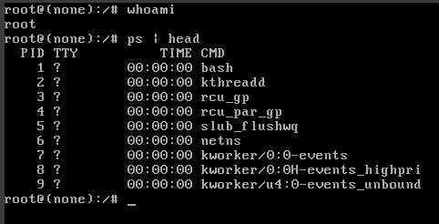

## Security with GRUB
### Restrict single user mode
[GRUB Prompt](README.md#grub-prompt)で触れたが、GRUB Promptから`linux`への引数の変更を行うことでシングルユーザーモードでの起動が可能であることを確認した．
`adduser USER_NAME sudo`とすれば、権限を持ったユーザーの作成が可能である．また、`passwd`でユーザのパスワードも設定できることから、PCのパスワードをわからずとも権限を持ったユーザでのログインができるといえる．

基本的にPCのコンソール画面にアクセスできるならば、上の操作によって管理者権限での利用ができる(そんな攻撃したら足跡消すの面倒くさい気もするが)．
だから、会社のPCとかを飲み屋に忘れたとか言われたら基本的に発狂ものだということ．当然物理セキュリティの運用としてこれは軽視できない．
実際に、STIG(Security Technical Implementation Guide = 米国防総省の国防情報システム局が管理するシステムに対する実装ガイド)の[V-238204](https://www.stigviewer.com/stig/canonical_ubuntu_20.04_lts/2021-03-23/finding/V-238204)にはシングルユーザーモードでのOS起動には認証を要求すべしと書いてある．

#### シングルユーザーモードでのシェル起動
本には`linux`の引数にsingleを指定すれば良いと書いてあったが、この場合rootユーザのpassを聞かれるのでこれは今回の話からずれる．
passを聞かれずにシングルユーザーモードでの起動をする方法は以下の通りである．
1. GRUB Prompt起動
2. `linux`の項目まで移動
3. 引数の設定について、`ro`以降のエントリを削除．
4. `ro`を`rw`にする．(ルートファイルシステムを書き込み可能にしてマウントする)
5. `init=/bin/bash`を追加(PID=1には`bash`がちゃんとくる)



パスワード認証が回避できた．
ユーザの追加など行いたい操作が一通り終わったら`exec /sbin/init`で通常のOS起動ができる．

#### パスワードを要求するようにする
grubのconfigによってシングルユーザーモードでの起動に認証を要求するようにできる．

`grub-mkpasswd-pbkdf2`を実行してパスワードのハッシュを作成する．


grub.dのconfigを変更する．
```
sudo vim /etc/grub.d/40_custom
```


コメントアウトの下の行が新しく追加された項目．

設定を変更したら`sudo update-grub`


ただ、この設定の場合はOSが立ち上がるときに常に(GRUBが実行されるときに)パスワードを要求するようになる．鬱陶しいかも(GRUBの設定とかtimeoutしても要求が走る)．

まぁ、そもそもパソコンが奪われていじられてしまうくらい狙われる団体なんて限られいるしこのくらいしないとだめなのかもしれない．．．


### Relevance to the secure boot
#### そもそもセキュアブートとは
ブート時に署名されていないコードの起動をブロックするセキュリティ機構．
この機能によって認証されるのは以下のような項目のもの
* ブートローダー
* カーネル
* カーネルモジュール
* UEFIアプリケーション

最新のマルウェアはより低レイヤーへの攻撃を行うことで簡単に持続性を得ることができる．
UEFIを標的としているマルウェアである`rootkits`や`bootkits`は今後勉強を進める上でのキーワードかもしれない．

#### なんの関係があるの？
Secure bootが有効なUEFI環境であってもGRUBは使われる．ただし、GRUBの更新が入るたびに上のように信頼できるプログラムとして署名を行うのは現実的でない．
ここで、[`shim`](https://github.com/rhboot/shim)とよばれる小さなUEFIプログラムをブートローダーとして使用する．
起動シーケンスは以下の通りとなる．
1. UEFI起動
2. Microsftなどの署名を確認する．(`shim`の検証)
3. `shim`が保持しているベンダの署名を確認
4. grubにはベンダの署名があって検証される
5. grubが起動する
6. kernelが起動する

ここでいうベンダとはGRUBやshim、kernelをビルドした個人・団体を指す．

なので、Secure bootおよびshimなどを理解していないとGRUBのconfigをいじるときに詰まるかもよという話．