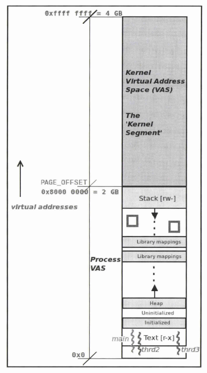
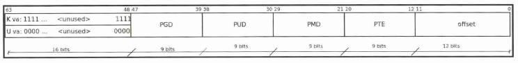
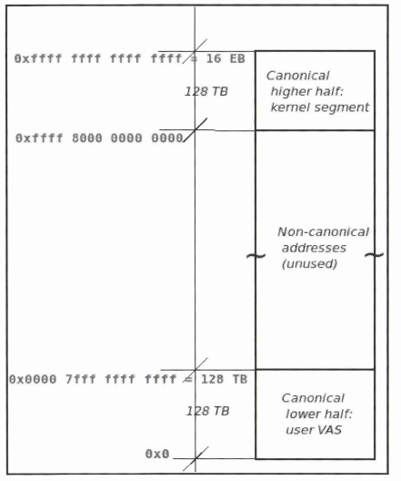
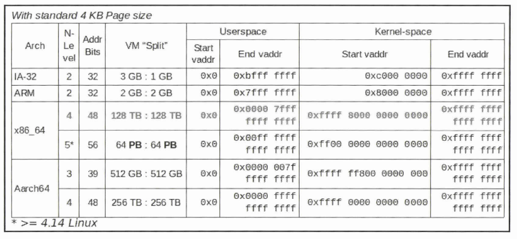
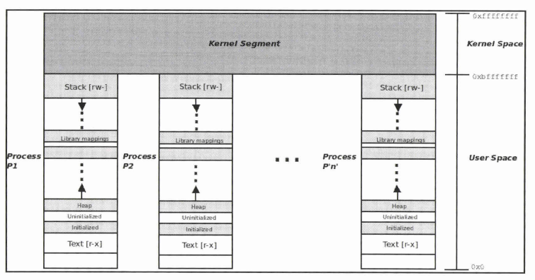
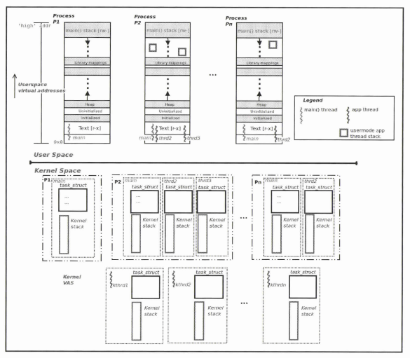

# Understanding the VM split
VASは0x0から`high address`までといっていた．これは単にOSが32bitプロセッサ用なら$2^{32}$だし、64bitなら$2^{64}$というだけの話．簡単のために32bit前提で進む．
>1978年にIntelが開発したMPUの型番が「8086」であり、1989年に発売された「80486」まで、「○○86」という型番が使用されていました。これらの製品に使われている命令セットアーキテクチャ(ISA)の名称がx86であり、また、製品シリーズの名称でもあるのです。

厳密にはx86=32bitではない．

## Hello, world internal
VASはサンドボックスのように各々が独立している．Cの`printf()`のようなライブラリ関数はどのようにアクセスできるのだろうか．

elfファイルのなかに埋め込まれているローダーが必要なライブライを検出し、.text,.dataをプロセスのVASにmmap(system call)することで、ライブラリ関数が呼び出せる．

`ldd`したら実際の依存関係がわかる．

ch6でユーザースレッドはユーザーVASとカーネルVASを持ち、内部でシステムコールがあったらカーネルVASの出番のような書き方があった．実際にVASを**VM split**することで2者を共存させつつ利用することができる．



2:2 = u:kで分割された32bitのVASは上図の通り．~~kernel space addrっぽいなぁってのが`0xffff`なのもうなずける~~
分割されたVASについて、スレッドの実行レベルに応じてコンテキストスイッチが走る．

VM splitは32bitの場合、`CONFIG_VMSPLIT_[1|2|3]G`, `CONFIG_PAGE_OFFSET`によって調整できる(カーネルビルド時の設定)．しかし、64bitでは直接の調整ができない．

## VM split on 64bit
### 前提
- 64bitシステムは下位48bitをアドレッシングに利用している(64bitをフルに使いこなせるのは16,384ペタバイトのRAMを持ったPC、そんなものはない．．)
- `printf("%x")`で表示できる仮想アドレスは
  - ユーザースペースで実行するならUVA
  - カーネル内、カーネルモジュールとかで実行するならKVA
  - Virtual Address


<!-- 48bit内のエントリについて適当に調べる？-->

MSB16bitに関しては符号拡張のようなノリで使われる．
- K-VASならbitを立てて
- U-VASなら落とす

つまり、
- KVAは`0xffff...`
- UVAは`0x0000...`

~~kernel space addrっぽいなぁってのがry~~

### 結局
64bitでのVM splitは高位、下位から128TBのセグメントで考える．


真ん中は使われていない．



アーキ別のVM splitは図の通り．
仮想アドレスなのでどうでもいいが、すべて真ん中が使われない形になる．

### おまけ
- KVAは非スワップメモリ
- UVAはスワップメモリ(`mlock`system call されているときを除く)
- スワップメモリ = RAMが不足してるときにHDD等に移動してよいメモリ





2つの図を並べてみると脳みそが若干混乱するのだが、、
- プロセスは(ユーザーモードなら)、Uスタックを1つ、Kスタックを1つ持つ
- UVASはプロセスごとに独立している．が、KVAS自体は共有している．
  - つまり、UVASの上に仮想的にくっついているKVASは実のとこは同一セグメントを見てる


# Examining the process VAS
`proc`ファイルシステムを用いて仮想アドレス空間を調査しようというお話．
`pfocfs`の役割は
- カーネルやハードウェアの詳細をみる手法の提供
- root書き込み可能なファイルを介してLinuxカーネルの調整を可能にする(`sysctl`)

似たものとして`sysfs`がある．こちらはシステム上のデバイスの調整を可能にする．
<!-- `sysfs`を調べる? -->

## Examining the user VAS in detail
任意のプロセスのユーザVASは`/proc/[PID]/maps`を介して確認できる．

例えば`cat`したときの自身のプロセスマップを確認すると
```sh

```
と確認できる．

<!-- テキストセグメント -->
一つの行を取り出すと、
```

```
このとき、該当のセグメントの大きさは単に`end-uva - start-uva`で求まる．次の項目はセグメントのパーミッションとマッピングフラグ情報(プライベート`p`か共有`s`)を記載している．実際は`mmap()`システムコールの第4引数と対応する．

<!-- mmapの定義 man等 -->

4つ目はプロセスVASにマッピングされたファイルのオフセットを示す．`inode`が0でないときにファイルマッピングと判断できる．(逆に`inode`が0のとき、`anonymous mappings`と呼び、ヒープやスタックセグメントを表す．)

5つ目は`mj:mn`とあるがデバイスファイルのメジャーナンバー`mj`と、マイナーナンバー`mn`である．

6つ目がイメージファイルの`inode`番号である．`inode`とはVFSの主要なデータ構造であり、ファイルオブジェクトのメタデータを保持している．

<!-- ls -i /bin/cat で確認 -->

ここでの話はUVA上であることを再確認してほしい(プロセスに固有のページテーブルを用いて物理アドレスへと変換される)．また、ここで登場するアドレスのMSB16bitが0であることも確認できる．

ただ、この点を踏まてもう一度先程の`cat`のプロセスマップを確認すると`vssyscall`が明らかにカーネルページのマップを表していることに気づくはずだ．最適化のために、実際はカーネルモードに切り替える必要のない一部のsyscallを処理するためのものである．`gettimeofday`,`time`,`getcpu`がこれにあたる．また、`vvar`,`vdso`というマッピングもまた、最適化のための(現代的な)ものである．

<!-- vvar vdso vssyscall futher reading? -->

## Frontends to view the process memory map
プロセスマップ関連をより理解しやすくするものとして、`/proc/[PID]/smaps`,`pamp`,`smem`がある．

<!-- それぞれ実行する -->

まら、プロセスマップを視覚化してくれる`procmap`というものがある．

<!-- procmap --pid=$(pgrep [your process]) -->

出力にKVAが含まれているが、この情報はLKMを用いてカーネルにクエリを実行し取得している．そのLKMは、記事ファイルを作成し、これをユーザスペースとのインタフェースとしている．

`sparse space`は単に空のメモリ領域を意味する．

# Understanding VMA(Virtual Memory Areas) basics
VMAはカーネルのメタデータ構造で、`/proc/[PID]/maps`の出力の各行はここから取られている．
ユーザVASの各セグメントにはOSによって維持されるVMAが存在する．

つまり、`VMAの数 = ユーザVAS内のマッピング(セグメント)の数`となる．
VMAはカーネルによって赤黒木データ構造で保持され、`current->mm->mmap`で維持される．メモリマッピングの際に`mmap`syscallが走っていることによる．

VMAはページフォルト、I/O中のカーネルページへのキャッシュなどがある．

# Examining the kernel segment

- `lowermem`
  - システムのRAMの量と等しい
  - この仮想仮想アドレスは`kernel logical address`とも呼ばれる
  - 物理的な対応アドレスから固定オフセット
  - `text`,`data`,`BSS`はここにある
- `the kernel vmalloc region`
  - カーネル、デバイスドライバは`vmalloc()`を用いてこの領域から仮想的に連続したメモリを割り当てられる
  - `ioremap`領域でもある(`ioremap`とは物理アドレス領域を仮想アドレスにマッピングするための関数)
- `the kernel modules space`
  - LKMのテキストやデータはここにロードされる
  - `insmod`実行時にはこの領域からメモリを割り当てる
- `highmem`
  - 32bitシステムで3:1のvmsplitを考えたとき、2GBのRAMがあったらKVASに収まらない
  - 一定量のメモリは`lowermem`として直接マップされる
    - IA-32では768MB
  - 残りのRAMが`highmem`として別領域(`ZONE_HIGHMEM`)にマップされる
  - 64bitシステムの莫大なVASにおいてこれを考える必要はない
